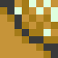
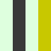
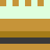

# Pokemon Gen 2 Style Tilemap

## Objectives
1. Similar but different tiles. The kind that when side by side you can't really work out which is the original.
1. Same colour palette 

## Notes
- Gameboy tiles are 8x8 pixels
- However, lots of things (including people) are 16x16 pixels (i.e. 2x2 tiles)
- Inspiration from [Pokemon Gold/Silver](https://www.spriters-resource.com/game_boy_gbc/pokemongoldsilver/sheet/60234/). This is also the spritesheet the originals come from.
- Slight inspiration from [The Legend of Zelda: Oracle of Ages](https://www.spriters-resource.com/game_boy_gbc/thelegendofzeldaoracleofages/) and [The Legend of Zelda: Oracle of Seasons](https://www.spriters-resource.com/game_boy_gbc/thelegendofzeldaoracleofseasons/)
- [Full map of Gen 2 Johto and Kanto](https://www.reddit.com/r/pokemon/comments/ez1v43/gen_ii_map_of_overworld_and_dungeons_as_they/). Copying this into Aseprite, setup the grid as `{X: 1, Y: 6, Width: 8, Height: 8}` to align the main map to the grid. Grid toggle is `ctrl + '`

## Outdoor

### Tiles

| Tile type                 | Original                                           | Custom                                           | Notes                                                                                                                                                                                                                                                                  |
| ------------------------- | -------------------------------------------------- | ------------------------------------------------ | ---------------------------------------------------------------------------------------------------------------------------------------------------------------------------------------------------------------------------------------------------------------------- |
| Path                      |                   |                   | Hard to make distinct when using the same colours.                                                                                                                                                                                                                     |
| Path with gravel          |            |            | Just some dots.                                                                                                                                                                                                                                                        |
| Grass - flat              |             |             | Basically a whole bunch of checkerboarding with some bits cut out.                                                                                                                                                                                                     |
| Grass - tall              |             |                                                  |                                                                                                                                                                                                                                                                        |
| Tree - short 00           |          |          | Background is just the grass texture. Followed the same shading style.  Ended up looking more bulbus at the top.                                                                                                                                                       |
| Tree - short 01           |          |          | Background is just the grass texture. Followed the same shading style. Ended up looking more bulbus at the top.                                                                                                                                                        |
| Tree - short 02           |          |          | Little shadow takes most of the space around the trunk. Ended up not using the same spiky tree look for the lower branches                                                                                                                                             |
| Tree - short 03           |          |          | Little shadow takes most of the space around the trunk. Ended up not using the same spiky tree look for the lower branches                                                                                                                                             |
| Tree - tall 00            |           |           | I think this also uses the normal grass background as a base                                                                                                                                                                                                           |
| Tree - tall 01            |           |           | I think this also uses the normal grass background as a base                                                                                                                                                                                                           |
| Sign - metal 00           |          |          | A taller sign.                                                                                                                                                                                                                                                         |
| Sign - metal 01           |          |          | A taller sign.                                                                                                                                                                                                                                                         |
| Sign - metal 02           |          |          | A taller sign.                                                                                                                                                                                                                                                         |
| Sign - metal 03           |          |          | A taller sign.                                                                                                                                                                                                                                                         |
| Ridge 00                  |               |               | Checkerboard design behind.                                                                                                                                                                                                                                            |
| Ridge 01                  |               |               | Just lots of light shading on the top.                                                                                                                                                                                                                                 |
| Ridge 02                  |               |               | Checkerboard design behind.                                                                                                                                                                                                                                            |
| Ridge 03                  |               |               | This one looks like a dog's breakfast without the context of other tiles.                                                                                                                                                                                              |
| Ridge 04                  |               |               | Surprisingly, this took a little bit of time to look okay and not overdone.                                                                                                                                                                                            |
| Ridge 05                  |               |               | Initially looks less defined, but together with other tiles it looks fine.                                                                                                                                                                                             |
| Ridge 06                  |               |               | Used a basic circle design. Might be worth looking into exaggerating the curve.                                                                                                                                                                                        |
| Ridge 07                  |               |               | First run of this design looked like Hank Hill's ass.                                                                                                                                                                                                                  |
| Ridge 08                  |               |               | I'm assuming the bottom right corner light pixel is the light peeking over the top of the rock at the top of the shadow.                                                                                                                                               |
| Water 00                  |               |                                                  |                                                                                                                                                                                                                                                                        |
| Water 01                  |               |                                                  |                                                                                                                                                                                                                                                                        |
| Water 02                  |               |                                                  |                                                                                                                                                                                                                                                                        |
| Water 03                  |               |                                                  |                                                                                                                                                                                                                                                                        |
| Water 04                  |               |                                                  |                                                                                                                                                                                                                                                                        |
| Water 05                  |               |                                                  |                                                                                                                                                                                                                                                                        |
| Water 06                  |               |                                                  |                                                                                                                                                                                                                                                                        |
| Grass - rustle 00         |        |                                                  |                                                                                                                                                                                                                                                                        |
| Grass - rustle 01         |        |                                                  |                                                                                                                                                                                                                                                                        |
| Flower - Johto 00         |        |                                                  |                                                                                                                                                                                                                                                                        |
| Flower - Johto 01         |        |                                                  |                                                                                                                                                                                                                                                                        |
| Building - Roof - flat 00 |  |  | Top left corner. Though there are many roof colours in game and a couple of roof designs too. I took inspriation from my [first building](https://github.com/nikouu/Pixelart-Practice/blob/main/first%20building.aseprite).                                            |
| Building - Roof - flat 01 |  |  | Top middle. Hard to be different here too I think when explicitly making a flat roof                                                                                                                                                                                   |
| Building - Roof - flat 02 |  |  | Top right corner                                                                                                                                                                                                                                                       |
| Building - Roof - flat 03 |  |  | Left middle                                                                                                                                                                                                                                                            |
| Building - Roof - flat 04 |  |  | Centre fill                                                                                                                                                                                                                                                            |
| Building - Roof - flat 05 |  |  | Right middle                                                                                                                                                                                                                                                           |
| Building - Roof - flat 06 |  |  | Bottom left corner. A skinnier look inspired by Kanto.                                                                                                                                                                                                                 |
| Building - Roof - flat 07 |  |  | Bottom middle                                                                                                                                                                                                                                                          |
| Building - Roof - flat 08 |  |  | Bottom right corner                                                                                                                                                                                                                                                    |
| Building - Wall 00        |       |       | Left building wall                                                                                                                                                                                                                                                     |
| Building - Wall 01        |       |       | Right building wall                                                                                                                                                                                                                                                    |
| Building - Wall 02        |       |       | Bottom left building corner                                                                                                                                                                                                                                            |
| Building - Wall 03        |       |       | Bottom middle building floor. I never realised this had the dots, even when a brick cladding is used. Originally I didn't have the dots, but they ended up providing a unconscious smoothness to the design.                                                           |
| Building - Wall 04        |       |       | Bottom right building corner                                                                                                                                                                                                                                           |
| Building - Cladding 00    |   |   | Hatched design. I'm awful at designs and couldn't come up with anything better.                                                                                                                                                                                        |
| Building - Cladding 01    |   |   | Brick. The pink building bricks were also used as the paths in Goldenrod                                                                                                                                                                                               |
| Building - Window         |        |        | Window. SImilar to the hatched design, couldn't come up with anything better. However in my first building linked above, I did have a nice window design inspired by Kanto, but I couldnt' get it to suit the look here.                                               |
| Building - Door 00        |       |       | Top left door. Never realised the door was so highlighted in the top half. I'm assuming this is to show the light coming out of the window. And perhaps this is the same door used in the night scenes, so it would look nicelyl it without having toc hange the tile. |
| Building - Door 01        |       |       | Top right door                                                                                                                                                                                                                                                         |
| Building - Door 02        |       |       | Bottom left door                                                                                                                                                                                                                                                       |
| Building - Door 03        |       |       | Bottom right door                                                                                                                                                                                                                                                      |
|                           |                                                    |                                                  |                                                                                                                                                                                                                                                                        |

### Constructed tiles

| Sprite         | Original                                              | Custom                                            |
| -------------- | ----------------------------------------------------- | ------------------------------------------------- |
| Tree - short   |    |  |
| Tree - tall    |     |   |
| Sign           |          |        |
| Ridge          |         |       |
| Water          |         |                                                   |
| Grass - rustle |  |                                                   |
| Flower - Johto |  |                                                   |
| Building       |      |    |
|                |                                                       |                                                   |

### Observations
- Due to the GBC limitation, only 4 colours per sprite. Often this is a "black", "white", main colour light, and main colour dark.
- I have no idea how shading works
- Checkerboards, checkerboards everywhere
- Weird asymmertry everywhere
- If an object doesn't fill in the entire space of the tile, the empty space is often the blank path without gravel colour

#### Water
⚠️**On further analysis, I beleve this to be kinda wrong, but left here because it's interesting and might be worth picking up in the future**⚠️
- I think water tiles are actually only 4 tiles rather than the 7 pulled from the sprite sheet. I say this because 
  - The local label(?) [.WaterTileFrames](https://github.com/pret/pokegold/blob/c133efea5f8438ea40be83dc3b2039494574c768/engine/tilesets/tileset_anims.asm#L405) points to a [4 frame png](https://github.com/pret/pokegold/blob/master/gfx/tilesets/water/water.png)
  - Via [AnimateWaterPalette](https://github.com/pret/pokegold/blob/c133efea5f8438ea40be83dc3b2039494574c768/engine/tilesets/tileset_anims.asm#L649), water palette seems to [cycle 4 colours](https://github.com/pret/pokegold/blob/c133efea5f8438ea40be83dc3b2039494574c768/engine/tilesets/tileset_anims.asm#L672) - `none(?)`, `light`, `dark`, `light` . I assume this is what changes the shading of the light coloured pixels in the frames. As some of the water frames are the same, just lighter/darker depending where in the cycle they are. Then ultimately the blank and just blue frame is either the palette colours swapping in no or blue value for the pixels. I find it difficult to read Assembly, but it seems to be something like this. 
  - An educated assumption might look like this:

  | Frame | Visible in-game Tile                  | Palette cycle | Original animation frame index (0 - 4) | Original frame                                        | Approx number of frames visible |
  | ----- | ------------------------------------- | ------------- | -------------------------------------- | ----------------------------------------------------- | ------------------------------- |
  | 1     |  | 0 (none)      | Frame 2                                |  | ~14?                            |
  | 2     |  | 0 (none)      | Frame 3                                |  | ~14?                            |
  | 3     |  | 1 (light)     | Frame 3                                |  | ~20?                            |
  | 4     |  | 1 (light)     | Frame 0                                |  | ~4?                             |
  | 5     |  | 2 (dark)      | Frame 0                                |  | ~24?                            |
  | 6     |  | 2 (dark)      | Frame 1                                |  | ~4?                             |
  | 7     |  | 1 (light)     | Frame 1                                |  | ~20?                            |
  | 8     |  | 1 (light)     | Frame 2                                |  | ~4?                             |

    - **The above is a sketchy understanding at best**
    - The tiles except the blank one add to 60 frames, or 1 second (GB/GBC runs at 60fps)
    - Makes sense that the minimum length is 4 frames due to [this comment](https://github.com/pret/pokegold/blob/c133efea5f8438ea40be83dc3b2039494574c768/engine/tilesets/tileset_anims.asm#L384). Maybe 4 frames is a "tick" here.
 - However, as neat as these are, I'll probably just be using the 7 frame water animation
 - The water animation gif above might be a bit fast
 - [bgb notes](https://github.com/doeg/gb-skeleton/blob/master/docs/bgb.md) 
 - [More bgb notes](https://eldred.fr/gb-asm-tutorial/part1/tracing.html)

### Wanted tiles
A list of types of tiles I'd like to have. 

#### Simple tiles
- Path
  - A completely blank tile. Usually intersperced with the path with  
- Path with gravel 
  - This is the most common path in Gen 2 Pokemon
gravel.
- Flat grass
  - The general green outside floor tile
- Short tree
  - The headbutt trees
- Tall tree
  - The trees that are double the short tree height
- Sign
  - The route/city signs
- Ridge
  - The ledges the player can jump off
  - The tiles that create rocky hills and mountains

#### Animated tiles
- Water
- Tall grass
- Flowers 
  - There are Johto flowers and Kanto flowers, But I'll be focusing on Johto. 
  - I think Johto flowers run at 24 frames per animation frame. Assembly [here](https://github.com/pret/pokegold/blob/c133efea5f8438ea40be83dc3b2039494574c768/engine/tilesets/tileset_anims.asm#L408).
  - Also both seem to [run at different speeds](https://twitter.com/crystal_rby/status/1163503969429336066).

#### Building tiles 
- Door
- Window
- Flat roof style
- Fill in for building (hatched?)
- Fill in for building (brick)

## Indoor