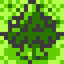

# Pokemon gen 2 style tilemap

## Objectives
1. Similar but different tiles
1. Use of same colour palette 

## Notes
- Gameboy tiles are 8x8 pixels
- However, lots of things (including people) are 16x16 pixels (i.e. 2x2 tiles)
- Inspiration from [Pokemon Gold/Silver](https://www.spriters-resource.com/game_boy_gbc/pokemongoldsilver/sheet/60234/)
- Inspiration from [The Legend of Zelda: Oracle of Ages](https://www.spriters-resource.com/game_boy_gbc/thelegendofzeldaoracleofages/) and [The Legend of Zelda: Oracle of Seasons](https://www.spriters-resource.com/game_boy_gbc/thelegendofzeldaoracleofseasons/)
- [Full map of Gen 2 Johto and Kanto](https://www.reddit.com/r/pokemon/comments/ez1v43/gen_ii_map_of_overworld_and_dungeons_as_they/). Copying this into Aseprite, setup the grid as `{X: 1, Y: 6, Width: 8, Height: 8}` to align the main map to the grid. Grid toggle is `ctrl + '`
- If an object doesn't fill in the entire space of the tile, the empty space is often the blank path without gravel colour

## Tiles

| Tile type        | Original                                   | Custom                                   | Notes                                                                                                                      |
| ---------------- | ------------------------------------------ | ---------------------------------------- | -------------------------------------------------------------------------------------------------------------------------- |
| Path             |           |           | Hard to make distinct when using the same colours.                                                                         |
| Path with gravel |    |    | Just some dots.                                                                                                            |
| Grass - flat     |     |     | Basically a whole bunch of checkerboarding with some bits cut out.                                                         |
| Tree - short 00  |  |  | Background is just the grass texture. Followed the same shading style.  Ended up looking more bulbus at the top.           |
| Tree - short 01  |  |  | Background is just the grass texture. Followed the same shading style. Ended up looking more bulbus at the top.            |
| Tree - short 02  |  |  | Little shadow takes most of the space around the trunk. Ended up not using the same spiky tree look for the lower branches |
| Tree - short 03  |  |  | Little shadow takes most of the space around the trunk. Ended up not using the same spiky tree look for the lower branches |
| Tree - tall 00   |   |   | I think this also uses the normal grass background as a base                                                               |
| Tree - tall 01   |   |   | I think this also uses the normal grass background as a base                                                               |
| Sign - metal 00  |  |  | A taller sign.                                                                                                             |
| Sign - metal 01  |  |  | A taller sign.                                                                                                             |
| Sign - metal 02  |  |  | A taller sign.                                                                                                             |
| Sign - metal 03  |  |  | A taller sign.                                                                                                             |
| Ridge 00         |       |       | Checkerboard design behind.                                                                                                |
| Ridge 01         |       |       | Just lots of light shading on the top.                                                                                     |
| Ridge 02         |       |       | Checkerboard design behind.                                                                                                |
| Ridge 03         |       |       | This one looks like a dog's breakfast without the context of other tiles.                                                  |
| Ridge 04         |       |       | Surprisingly, this took a little bit of time to look okay and not overdone.                                                |
| Ridge 05         |       |       | Initially looks less defined, but together with other tiles it looks fine.                                                 |
| Ridge 06         |       |       | Used a basic circle design. Might be worth looking into exaggerating the curve.                                            |
| Ridge 07         |       |       | First run of this design looked like Hank Hill's ass.                                                                      |
| Ridge 08         |       |       | I'm assuming the bottom right corner light pixel is the light peeking over the top of the rock at the top of the shadow.   |
|                  |                                            |                                          |                                                                                                                            |

## Constructed sprites

| Sprite       | Original                                            | Custom |
| ------------ | --------------------------------------------------- | ------ |
| Tree - short |  |        |
| Tree - tall  |   |        |
| Sign         |        |        |
| Ridge        |       |        |

## Observations
- Due to the GBC limitation, only 4 colours per sprite. Often this is a "black", "white", main colour light, and main colour dark.
- I have no idea how shading works
- Checkerboards, checkerboards everywhere
- Weird asymmertry everywhere

## Wanted simple tiles
- Path
  - A completely blank tile. Usually intersperced with the path with  
- Path with gravel 
 - This is the most common path in Gen 2 Pokemon
gravel.
- Flat grass
- Short tree
  - In Gen 2, the headbutt trees
- Tall tree
  - In gen 2, the trees that are double the short tree height
- Sign
  - The route/city signs
- Ledge
  - The ledge the player can jump off. Needs only 3 sides (left, right, bottom)
- Mountain tiles
  - Filled in ledge tiles that create rocky hills and mountains

## Wanted animated tiles
- Water
- Flowers 
- Tall grass

## Wanted building tiles 
- Door
- Window
- Flat roof style
- Fill in for building (hatched?)
- Fill in for building (brick)

